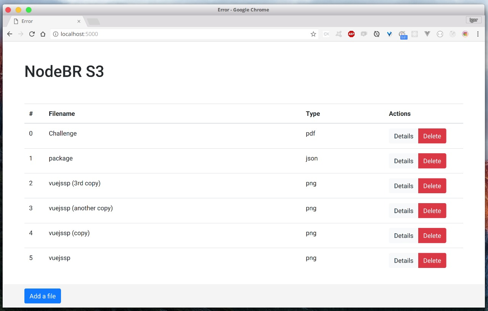

### Node.js File System Module

> A upload files DEMO to [NodeBR meetup](https://www.meetup.com/nodebr/events/246613295/).



#### List all of files

**GET `/files`**

_response_
```javascript
{
   "files":[
      {
         "name":"Challenge",
         "type":"pdf",
         "index":0
      },
      {
         "name":"package",
         "type":"json",
         "index":1
      },
      {
         "name":"vuejssp (3rd copy)",
         "type":"png",
         "index":2
      },
      {
         "name":"vuejssp (another copy)",
         "type":"png",
         "index":3
      },
      {
         "name":"vuejssp (copy)",
         "type":"png",
         "index":4
      },
      {
         "name":"vuejssp",
         "type":"png",
         "index":5
      }
   ]
}
```

#### List details from a specific file

**GET `/files/:filename`**

_response_
```javascript
{
   "dev":66306,
   "mode":33204,
   "nlink":1,
   "uid":1000,
   "gid":1000,
   "rdev":0,
   "blksize":4096,
   "ino":11541611,
   "size":46462,
   "blocks":104,
   "atime":"2018-01-20T21:05:40.623Z",
   "mtime":"2018-01-09T19:45:05.452Z",
   "ctime":"2018-01-20T21:05:40.607Z",
   "birthtime":"2018-01-20T21:05:40.607Z",
   "filename":"vuejssp.png"
}
```

#### Delete a specific file

**DELETE `/files/:filename`**

_response_
```javascript
{
    "filename": "vuejssp.png"
}
```